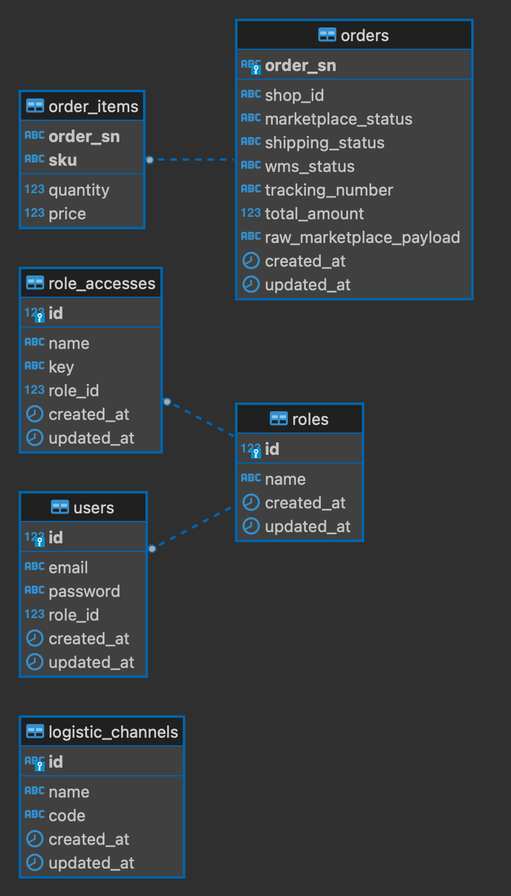

# Warehouse Management System

Integration with External Marketplace API

## Architecture

Frontend
- Next.js Typescript
- Redux Toolkit
- TailwindCSS
- Middleware for Page

Backend
- Golang Fiber
- Auth Service (JWT + Refresh Token + Redis)

Infrastructure
- Database PostgreSQL
- Redis for store WMS token and Marketplace API token (access token, refresh token, auth code)
- Scheduler for Sync Order data and Order Item data from Marketplace API to Database
- JWT for authentication endpoint

Flow Authentication
- Login (Generate Access Token = 2 hour and Refresh Token = 24 hour)
- Access token and refresh token stored in Frontend Cookie
- In Frontend when access token expired, Generate Refresh Token
- After generate refresh token, old access token and refresh token will be revoked
- When logout, access token and refresh token will be revoked

## Database Design

- roles: used to store a list of roles in the system and to determine user's access right to certain features.
Example roles: Warehouse Operator, Warehouse Staff, Picker, Packer, Warehouse Admin
- role_accesses: used to store each role's access right to certain features.
Example role accesses: orders.list = to see the order list, orders.detail = to see the order detail, orders.pick = to do the pick the order, orders.pack = to do the pack order, orders.ship = to do ship the order.
- users: used to store user account that can access the system and set role each account.
- orders: used to store the order list and obtained from the Marketplace API.
- order_items: used to store the order item list and obtained from the Marketplace API.
- logistic_channels: used to store the logistic channel list and obtained from the Marketplace API, logistic channel id is required for Marketplace API /logistic/ship, which the Marketplace API is used for API /order/send.

## Order Lifecycle

- Scheduler will to get the order list from Marketplace API and store in database. Initial wms_status is READY_TO_PICK, but if the order already exists (check by order_sn field), system will update all field except wms_status and updated_at. 
- After scheduler is done to get the order list, users who have Picker role can do pick the order if the wms status is READY_TO_PIC. If user do pick the order, wms status will change to PICKING. In frontend pick button only show when wms status is READY_TO_PICK and user login role is Picker.
- After the order wms status change to PICKING, users who have Packer role can do pack the order if the wms status is PICKING. If user do pack the order, wms status will change to PACKED. In frontend pack button only show when wms status is PICKING and user login role is Packer.
- After the order wms status change to PACKED, uses who have Warehouse Admin role can do ship the order if the wms status is PACKED. If user do ship the order, wms status will change to SHIPPED and will get Tracking Number and Shipping Status from Marketplace API /logistics/ship and do update to the order.

## Marketplace Integration

- For synchronize order list, order item list, and logistic channel list, system runs every minute to retrive data.
- Before fetch Marketplace API data which the API requires access token, and refresh token, system will check access token first which is stored in redis, if there is no access token in redis, system will fetch Marketplace API /oauth/authorize to retrive auth code, then auth code requires to fetch Marketplace API /oauth/token to retrive access token and refresh token and then save it to Redis. If access token is expired, System will fetch Marketplace API /oauth/token refresh token to retrive new access token and new refresh token and retry fetch the API.
- To prevent duplicate fetch Marketplace API /oauth/token refresh token, system using "golang.org/x/sync/singleflight". If different goroutine call getAndSetAccessToken function in same time, first goroutine will handle call getAndSetAccessToken function, after first goroutine finish, other goroutine just get retrived result of getAndSetAccessToken function from first goroutine.
- Example: if Marketplace API /order/list error 401 Unauthorized, system will retry one more time but with call Marketplace API /oauth/token refresh token to get new access token and new refresh

## Error Handling

